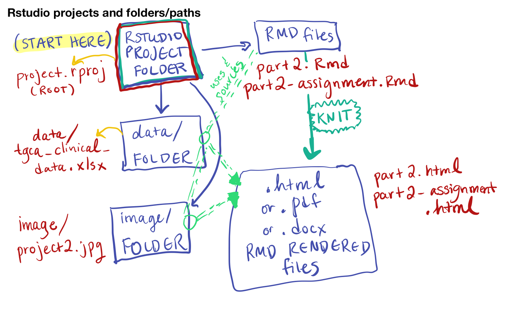

```{r setup, include=FALSE}
# The first chunk is special because if you try to run a chunk below without running anything else first, R will automatically run this first

# These are "global options" for our R markdown, the set the default chunk options for our code chunks below; all can be adjusted in individual chunks
knitr::opts_chunk$set(
  eval       = TRUE,    # whether to run code in code chunk
  include    = TRUE,    # whether to include the chunk output
  echo       = TRUE,   # Whether to show code chunk in final output
  error      = TRUE,    # whether to display error messages
  message    = FALSE,   # whether to preserve messages
  warning    = FALSE,   # whether to preserve warnings
  comment    = "#>",    # a character string to append at start
                        # of each line of results in final document
  tidy       = FALSE,   # whether to tidy code chunks for display
  #dpi        = 96, 
  #fig.width  = 6,       # consistent width for figures
  #fig.asp    = 0.618,   # the golden ratio, can be adjusted in individual chunks
  #out.width  = "100%",   # controls the output size
  fig.path = "figs/",     # save each plot into this folder (creates folder)
  fig.align  = "center" # give plot room to breathe
)

```

# Learning Objectives

By the end of this session, you should be able to:

1.  **Import** spreadsheet-style data into R as a `data.frame`.

# Rstudio projects, repeat-summary

[creating new projects][create project for function of the week folder]

# Importing spreadsheet-style data into R

```{r}

```

Once you have your notebook open, let's talk about its location. It is located in the same folder as the `project.rproj` file. The location of this file (also called an "RProject" file) is always considered the `root` directory of the project.

It's where you start from that determines the file directory path for loading data.

Since this notebook, `part2.Rmd` is in the same folder as the `project.rproj` file, then when we need to refer to data files, it is *relative* to the root folder.

When you're starting out, it's best to keep your RMarkdown notebooks and files in the **root** folder. It will help prevent you from dealing with a lot of headaches.

## A good place to put your data

Take a look at the `data/` folder, and where the `tcga_clinical_data.xlsx` file is.

In our notebook, how do we refer to that file name? Since we're in the root, we can refer to it as

`data/tcga_clinical_data.xlsx`

This is called a *relative* file path. Using R projects lets us use this shorthand. If we did not use a Rstudio project, we would need an *absolute* file path, such as:

`Home/Dropbox/Work/rprogramming/part2/data/tcga_clinical_data.xlsx`

Then, if we moved the folder "rprogramming" somewhere else, say, to our Desktop, the data import code would break as the absolute file path would point to nothing.

Or, we could zip up the folder and email it and someone else could run all the code easily.

## Loading our excel file

Now we can use a built-in function called `read_excel()` that will help us load our data into R:

```{r}
brca_clinical <- read_excel("data/tcga_clinical_data.xlsx",
                            sheet = 1, 
                            skip = 1,
                            na = "NA"
                            )
```

You can see the excel file here: <https://docs.google.com/spreadsheets/d/1E6jmCB9nfeIJ_zlSH6HJCUmKwwcMTWwP0EwEcAHo0CU/edit?usp=sharing>

You should see `brca_clinical` appear in the Environment window on the upper right panel in RStudio. If you click on the spreadsheet icon to the right of `brca_clinical` there, a new tab will appear next to your R script in the Source window.

> Clicking on this spreadsheet icon in the Environment window is a shortcut for running `View(brca_clinical)`; you'll see this code appear in the Console after clicking.

## Challenge 1 (5 minutes, on your own)

Take a look at the documentation for `read_excel()`. This is a package in the package `readxl`, which is installed as part of the `tidyverse`. Make notes on each of these questions and be prepared to contribute to the discussion.

1.  What does the `skip` argument do?
2.  Do we need to refer to a `sheet` within an excel file as a number, or can we refer to it as the sheet name instead? (Try doing this)
3.  What does the `guess_max` argument do?
4.  How do we include other possible missing value markers (i.e. 9999)

```{r}
?read_excel
```

[Your answers here]

Now that we have the data imported and assigned to an object, we can take some time to explore the data we'll be using for the rest of this course.

[environment -\> import dataset option][what is real]

## Notes on the Data

-   These data are clinical cancer data from the [National Cancer Institute's Genomic Data Commons](https://gdc.cancer.gov), specifically from The Cancer Genome Atlas, or [TCGA](https://www.cancer.gov/about-nci/organization/ccg/research/structural-genomics/tcga).
-   Each row represents a patient, and each column represents information about demographics (race, age at diagnosis, etc) and disease (e.g., cancer type).
-   The data were downloaded and aggregated using an R script, which you can view in the [GitHub repository for the fredhutch.io course](https://github.com/fredhutchio/R_intro/blob/master/0dataset.R).

## Challenge 2 (5 minutes):

Inspect, and import the following sheets from the `tcga_clinical_data.xlsx` excel file.

Confirm that you have loaded them correctly by clicking on the objects in the `Environment` pane in the top right.

1.  The `CESC` sheet. Save it as `cesc_clinical`.
2.  The `LUSC` sheet. Save it as `lusc_clinical`.

```{r eval=FALSE}
# change eval=TRUE in the code chunk options

# load cesc_clinical here

# What should be the sheet argument?

# do you need to skip a line?

cesc_clinical <- read_excel("data/tcga_clinical_data.xlsx",
                            sheet = ____, 
                            skip = ___,
                            na = "NA"
                            )  

#load lusc_clinical here

lusc_clinical <- 


```

Importing data can be tricky and frustrating. However, if you can't get your data into R, you can't do anything to analyze or visualize it. It's worth understanding how to do it effectively to save you time and energy later.

I highly recommend reading the [introduction/vignette for the `readxl`](https://readxl.tidyverse.org/) package and looking at the [cheatsheet.](https://raw.githubusercontent.com/rstudio/cheatsheets/main/data-import.pdf)

# Tips on Formating your Excel file for R

Here are some tips on formatting your data to get it into R easier.

Click on the code block below to load up a graphic.

```{r}
# Image from Allison Horst
knitr::include_graphics("image/tidydata_1.jpg")
```

```{r}
# Image from https://r4ds.had.co.nz/tidy-data.html
knitr::include_graphics("image/tidy-1.png")
```

1.  **Tidy is Best**. Try to format your spreadsheet where the columns correspond to variables you're measuring, and a row corresponds to an observation.

In our example:

-   each row corresponds to a patient
-   each column corresponds to a *variable* of clinical data
-   each cell has a value

We'll be seeing that this format is called **Tidy Data**, and it lets us do all sorts of things in R successfully.

2.  **Transpose is your Friend in Excel.**\* If your data isn't in this format, no worries! You can copy it to a new sheet and use the transpose option when you're pasting it, and then load that in.

3.  **Every column needs a name.** Every one of your columns should be named at the top, and should begin with a letter. Numbers and special characters can cause errors in your data analysis pipeline.

4.  **Color information is hard to get into R**. Avoid using color coding of cells if that is extra information attached to a cell. Instead, make the information the color is representing its own column.

5.  **Extra Lines are OK!** Extra lines before the column header are ok, as you've seen. It's sometimes better to have a "notes" sheet where you put extra information or, better yet, a data dictionary. (Extra lines at the end of data are more difficult to deal with, and often unexpected!)

## Untidy data: example 1

```{r}
untidy_data <- tibble(
  name = c("Ana","Bob","Cara"),
  meds = c("advil 600mg 2xday","tylenol 650mg 4xday", "advil 200mg 3xday")
)
untidy_data
```

You will learn how to tidy this!

## Untidy data: example 2

```{r}
untidy_data2 <- tibble(
  name = c("Ana","Bob","Cara"),
  wt_07_01_2018 = c(100, 150, 140),
  wt_08_01_2018 = c(104, 155, 138),
  wt_09_01_2018 = c(NA, 160, 142)
)
untidy_data2
```

### Challenge: why is this untidy? how would you make it tidy?

## One last bit of Tidy-related wisdom

```{r}
knitr::include_graphics("image/tidydata_2.jpg")
```

Illustration by Allison Horst

## Further Reading

Much more info about formatting spreadsheets can be seen in our [Better Spreadsheets Workshop](https://better-spreadsheets.netlify.app). Which is based on Kara Woo and Karl Broman's paper [Organizing Data in Spreadsheets](https://www.tandfonline.com/doi/full/10.1080/00031305.2017.1375989). This is one of the best papers about how to organize data that I know of.

The opening is one of my favorite sentences written about spreadsheets:

> Spreadsheets, for all of their mundane rectangularness, have been the subject of angst and controversy for decades.

And be sure to pass it on to your friends!

Other things I recommend you read:

-   I highly recommend reading the [introduction/vignette for the `readxl`](https://readxl.tidyverse.org/) package and looking at the [cheatsheet.](https://raw.githubusercontent.com/rstudio/cheatsheets/main/data-import.pdf)

-   [File Paths](https://djnavarro.net/slides-project-structure/#40) - This presentation from Danielle Navarro is gold. It talks about reasons why you should use projects
